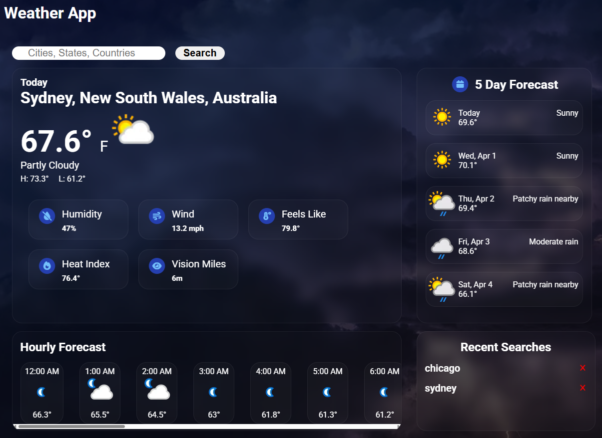

# 🚧Weather App 🚧

[Live Demo](https://allencodess.github.io/weather-app/)

I’m aware that exposing an API key in client-side code isn’t best practice. For this project, I’m using a free API with limited risk, but in a production environment I would secure keys using environment variables and a backend.

## ScreenShot

## Overview

This project is a Weather Application that displays current conditions, future forecast, hourly forecast, and recent searches made by the user using the WeatherAPI (free version).

Users can do the following:

- Search locations by City, Zip Code, State, or Country.
- View 24 hour forecast for the current day.
- View a 6 day forecast (WeatherAPI free version).
- View their recent searches.

## Features

- Location Search via WeatherAPI
- Shows error when invalid locaiton is used.
- Shows indicator when fetching data.
- Adds Previous Searches in Local Storage.

## Technologies Used

- HTML
- CSS
- Javascript
